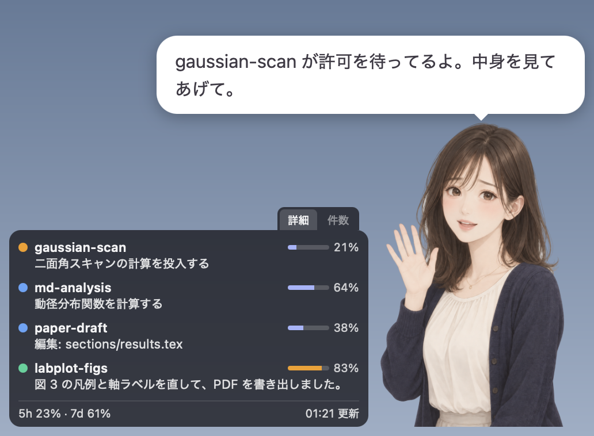

# marimo

marimo は、Claude Code の作業状況を画面の隅で知らせるデスクトップウィジェットです。20 代半ばの女性、小春（こはる）の立ち絵がふんわりとしたイラストで画面の隅に立ち、各セッションが作業中なのか、承認を待っているのか、終わったのかを表情と吹き出しで伝えます。横に並ぶ小さなパネルには、セッションごとのコンテキスト使用率と、アカウント全体の 5 時間と 7 日の利用制限も出ます。右クリックメニューから、Claude Code のマスコットの Clawd のドット絵に切り替えることもできます。

<p align="center">
  
</p>

上の画面は、架空のセッションを四つ動かしたときの様子です。gaussian-scan がコマンドの実行許可を待っているので、立ち絵が手を振って吹き出しで知らせています。パネルには、承認待ち（橙）、作業中（青）、完了（緑）のセッションが 1 行ずつ並び、それぞれのコンテキスト使用率と今の作業の要約が出ています。いちばん下の行は、アカウント全体の利用制限です。

別の作業をしていても、Claude Code のウィンドウを見に行かずに状況が分かるようにすることが marimo の目的です。情報源は Claude Code のフック（hook。特定の出来事が起きたときに Claude Code が呼び出す外部コマンド）と statusLine（端末で動かすコマンドラインインターフェース、つまり CLI の画面下部に一行を表示するための外部コマンド）で、どちらも Claude Code の公式の仕組みです。

> [!NOTE]
> marimo は有志が作った非公式のツールで、Anthropic とは関係がなく、Anthropic が承認したものでもありません。Claude と Claude Code は Anthropic の商標です。利用制限の取得に使う API（アプリが外部のサービスを呼び出すための窓口）は Anthropic が公開していないもので、予告なく使えなくなる可能性があります（[利用制限の表示](docs/usage.md#利用制限の表示)を参照）。

## ドキュメント

この README には、marimo が見せるもの、動作環境、導入の手順をまとめています。詳しい説明は、次の三つの文書に分けています。

- [marimo の使い方](docs/usage.md) では、起動と終了、アイコンと右クリックメニュー、パネルの見方、セッションへの移動、立ち絵の表情、利用制限の表示、更新、困ったときの対処、アンインストールを説明しています。
- [見た目を変える](docs/customize.md) では、セリフの変え方、自分のキャラクターの作り方、素材の作り直し方を説明しています。
- [marimo の開発](docs/development.md) では、ソースからのビルド、`install` が書き換えるもの、ファイルとデータ、プライバシーとセキュリティ、テスト、アイコンの描き直し方、仕組みを説明しています。

## marimo が見せるもの

### 状態の種類と優先度

marimo は Claude Code のセッションを次の五つの状態に分けて扱います。

| 状態 | 意味 | この状態になるきっかけ |
| --- | --- | --- |
| 承認待ち | Claude Code が利用者の操作を待っています | ツールの実行許可の確認（PermissionRequest。サブエージェントからのものを含みます）、質問（AskUserQuestion）、計画の承認（ExitPlanMode）、入力の要求（Elicitation）、承認待ちの通知 |
| エラー | 応答が途中で失敗しました | StopFailure（利用制限に達したときなど） |
| 作業中 | Claude が考えているか、ツールを使っているか、サブエージェントが動いています | プロンプトの送信、ツールの実行の前後、サブエージェントの開始（SubagentStart） |
| 完了 | 応答が終わり、動いているサブエージェントもありません | Stop、最後のサブエージェントの終了（SubagentStop） |
| 待機 | 何もしていません | セッションの開始。中断などで作業中のまま残ったセッションは、応答の終了から 60 秒ほどで届く待機の通知（idle_prompt）でも待機へ戻ります |

完了は「応答が終わった」ことだけを意味し、成功したとは限りません。完了の状態は、次のプロンプトを送るまで続きます。セッションが終わる（SessionEnd）と、marimo はそのセッションを一覧から消します。

複数のセッションが同時に動いているとき、立ち絵の表情にはいちばん優先度の高い状態が出ます。優先度は高い順に、承認待ち、エラー、作業中、完了、待機です。完了を作業中より下に置いているのは、あるセッションの作業を見守っている間に、他のセッションが終わるたびに表情が切り替わらないようにするためです。完了したことはパネルの行の色で分かります。

### 立ち絵、吹き出し、パネルの役割

marimo の窓は、立ち絵、吹き出し、パネルの三つでできています。

<p align="center">
  
</p>

- **立ち絵**は、全体の状態をひと目で伝えます。待機中と作業中は瞬きと呼吸のような小さな動きがあり、作業中は使っているツールによって顔が変わり、待機中はときどき仕草を見せます。表情の一覧と切り替わり方は、[立ち絵の表情](docs/usage.md#立ち絵の表情)に書いています。
- **吹き出し**は、承認待ち、完了、エラーになったときに立ち絵の頭の上に出て、どのリポジトリ（リポジトリの外では作業フォルダ）で何が起きたかをひとことで伝えます。セリフは状況に合わせて用意された候補から選ばれ、大規模言語モデル（LLM）は呼びません。
- **パネル**は、立ち絵の左側に、待機以外のセッションを 1 セッション 1 行で並べます。各行には状態の色、Claude Code と Codex のどちらのセッションかを示すアプリのアイコン、リポジトリ名とチャットの題名、コンテキスト使用率、今何をしているかの短い要約、そして最後に動きがあってからの時間が出ます。パネルの下端には 5 時間と 7 日の利用制限が一行で出ます。

キャラクターは、既定の小春と Clawd から選べます（[右クリックメニュー](docs/usage.md#右クリックメニュー)を参照）。Clawd は Anthropic の Claude Code のマスコットです。marimo では、Claude Code の起動時に出るロゴと同じ形のドット絵で描いています。

### Codex への対応

marimo は、OpenAI の Codex CLI のセッションも記録して表示できます。情報源は Codex のフックで、Claude Code と同じ名前のイベントを受け取り、同じ規則で状態を決めます。Codex のセッションは Claude Code のセッションと同じパネルに並び、立ち絵の表情と吹き出しにも同じように反映されます。どちらのセッションかはパネルの行のアイコンで見分け（[パネルの見方](docs/usage.md#パネルの見方)を参照）、Codex の利用制限は Claude Code の利用制限と同じ行に並びます（[利用制限の行](docs/usage.md#利用制限の行)を参照）。Codex のフックから何を記録するかは、[Codex のフックから記録するもの](docs/development.md#codex-のフックから記録するもの)に書いています。

## 動作環境

marimo は macOS で動作を確かめており、Windows 11 でも大半の機能を確かめています。Claude Code のどの画面から使うかによって、使える機能が変わります。

Claude Code は 2.1.139 以降が必要です。marimo は、この版で加わった exec form という書き方でフックを登録するためです。

| Claude Code の使い方 | 確認の状況 | 使える機能 |
| --- | --- | --- |
| macOS の端末で動かす CLI | 確認済み | すべての機能が使えます。フックと statusLine の両方が動きます。更新用のスクリプトによる更新も確かめています。行を押してセッションへ移動する機能は Terminal.app で確かめており、iTerm2 と VS Code の統合ターミナルでの見分け方は、それぞれのアプリの文書に基づいています |
| macOS のデスクトップアプリの Code タブ | 確認済み | フックは承認待ちを含めて届きます。statusLine はこの画面では呼ばれないので、利用制限を出すには[利用制限を API から取得](docs/usage.md#利用制限の表示)を有効にします。API から取った値が statusLine の値と揃うかどうかと、キーチェーンの確認の画面に marimo の名前が出るかどうかは、確かめていません |
| VS Code の拡張機能の画面 | 未確認 | statusLine が動くかどうかを確かめていません |
| Windows | 一部確認済み | Windows 11 で、ビルド、NSIS（Windows 向けのインストーラを作る仕組み）のインストーラによる導入、更新用のスクリプトによる更新、`install`、フックの発火、自動起動、クリック透過、通知領域のアイコンから窓を隠して出し直す操作を確かめています。statusLine が無い場合の `install` による登録が Git Bash と PowerShell のどちらでも動くことと、既存の statusLine を `install` が包んでも元の表示が変わらず、CLI のセッションでコンテキスト使用率がパーセントで出ることも確かめています（[statusLine の包み方](docs/development.md#statusline-の包み方)を参照）。包めない statusLine を使っている場合も、利用制限は「利用制限を API から取得」で出せ、`~/.claude/.credentials.json` のトークンで取得できることを確かめています。行を押してセッションへ移動する機能は、デスクトップアプリの Code タブ、Windows Terminal、conhost、VS Code の統合ターミナルのどれでも確かめています（[セッションへ移動する](docs/usage.md#セッションへ移動する)を参照） |
| Linux | 未確認 | 動作を確かめていません |
| クラウドで動くセッション（スマートフォンの Code タブなど） | 対象外 | 手元の `~/.claude/settings.json` を読まないので、フックが届きません |
| Cowork | 対象外 | settings.json のフックが発火しないという報告があります |
| macOS の Codex のデスクトップアプリ | 確認済み | `/hooks` で信頼したフックが届き、作業中、`request_permissions` による承認待ち、完了、題名、コンテキスト使用率がパネルに出ることと、行を押すとデスクトップアプリが前面に出ること、利用制限が `codex_rate_limits.json` に記録されることを確かめています（[Codex への対応](#codex-への対応)を参照） |
| macOS の端末で動かす Codex CLI | 確認済み | Terminal.app で、フックが届いて作業中と承認待ちが出ることと、行を押すと端末が前面に出ることを確かめています |
| Windows の Codex CLI | 一部確認済み | 実行ファイルのパスが条件を満たす場合だけフックを登録します（[Codex のフック](docs/development.md#codex-のフック)を参照）。Codex のフックが届いてパネルの行が動くことと、アプリのアイコンが出ることを確かめています |

## インストール

インストールは四つの段階に分かれています。1. から 3. は最初に一度だけ行い、そのあと繰り返し必要なのはアプリの起動だけです。新しい版へ更新するときは、[4. 更新する](#4-更新する)のスクリプトを使うと、ビルドから起動し直すまでを一つのコマンドで済ませられます。ここからのコマンドは、リポジトリの直下で実行します。

### 1. ビルドする

marimo は配布用のバイナリを用意していないので、リポジトリを手元に置いたら自分でビルドします。必要なツールとそのバージョンは、[必要なもの](docs/development.md#必要なもの)に書いています。

まず、Claude Code から呼ばれるコマンド `marimo-hook` をビルドします。

```bash
cargo build --release -p marimo-hook
```

次に、`app/` へ移動して画面部分の依存をインストールし、Tauri でアプリをまとめます。`npm run tauri -- build` は、画面部分のビルド（`npm run build`）と Rust 側のビルドをまとめて実行します。最後の `cd ..` で、リポジトリの直下へ戻ります。

```bash
cd app
npm install
npm run tauri -- build
cd ..
```

できあがるものの場所は[ビルドの成果物](docs/development.md#ビルドの成果物)に書いています。

### 2. フックと statusLine を登録する

フックと statusLine の登録は、`marimo-hook install` を利用者が端末で実行して行います。この手順は Claude Code 自身の設定ファイル `~/.claude/settings.json` を書き換えるので、Claude Code に頼まずに自分で実行してください。Claude Code は権限の設定によっては自分の設定ファイルの書き換えを拒みますし、何が変わるのかを自分の目で確かめておくと安心です。

最初に `--dry-run` を付けて実行すると、ファイルを書き換えずに、変更後の settings.json と変更点だけを表示します。

```bash
./target/release/marimo-hook install --dry-run
```

内容に問題がなければ、`--dry-run` を外して実行します。

```bash
./target/release/marimo-hook install
```

`install` は書き換える前に settings.json のバックアップを取り、既存のフックや設定はそのまま残します。何をどう書き換えるかは、[フックと statusLine の登録](docs/development.md#フックと-statusline-の登録)に書いています。

Codex を使っている場合は、`install` が Codex の `hooks.json` にもフックを登録します。登録した後に Codex CLI で `/hooks` を開き、marimo のフックを信頼してください（[Codex のフック](docs/development.md#codex-のフック)を参照）。

### 3. アプリを置いて起動する

macOS では、`marimo.app` を `/Applications` へコピーします。

```bash
cp -R target/release/bundle/macos/marimo.app /Applications/
```

Finder から開くか、次のコマンドで起動します。初めて開くときに macOS が「開けません」と警告した場合の開き方は、[ad-hoc 署名について](docs/development.md#ad-hoc-署名について)に書いています。

```bash
open /Applications/marimo.app
```

Windows では、NSIS のインストーラで入れます。利用者ごとのインストールなので、管理者の権限は要りません。

```powershell
.\target\release\bundle\nsis\marimo_0.1.0_x64-setup.exe
```

`%LOCALAPPDATA%\marimo\marimo.exe` に入り、スタートメニューにショートカットができるので、そこから起動します。

起動すると、画面の右下に立ち絵が現れ、macOS ではメニューバーに、Windows では通知領域にアイコンが出ます（[marimo の使い方](docs/usage.md#起動と終了)を参照）。ログインのたびに起動したいときは、右クリックメニューの「ログイン時に起動」を選びます（[ログイン時に起動する](docs/usage.md#ログイン時に起動する)を参照）。

### 4. 更新する

新しい版へ更新するときは、`cp` で上書きせずに、リポジトリに入っている更新用のスクリプトを使います。スクリプトは自分の置き場所からリポジトリを見つけるので、どのフォルダから実行してもかまいません。ここではリポジトリの直下で実行します。macOS では次のコマンドを実行します。

```bash
tools/update.sh
```

Windows では、PowerShell で次のコマンドを実行します。スクリプトの実行が既定で禁じられている環境でも動くよう、このコマンドの間だけ実行ポリシーを緩めて起動します。

```powershell
powershell -ExecutionPolicy Bypass -File .\tools\update.ps1
```

スクリプトが行うことと、失敗したときの動きは[更新する](docs/usage.md#更新する)に書いています。marimo を取り除くときは、[アンインストール](docs/usage.md#アンインストール)の手順に従ってください。

## 不具合の報告と貢献

不具合の報告や改善の提案は、GitHub の Issue で受け付けています。再現の手順と、OS（macOS か Windows）とそのバージョン、Claude Code と Codex のどちらで起きたかとそのバージョン、CLI とデスクトップアプリのどちらで使っているかを添えてもらえると助かります。状態ファイルや会話ログを添えるときは、作業フォルダ名やコマンドに人に見せたくない情報が入っていないかを先に確かめてください。

トークンの扱いや settings.json の書き換えなど、安全に関わる問題を見つけた場合は、公開の Issue ではなく、GitHub の Security Advisories から非公開で報告してください。

プルリクエストを送るときは、[テストと検査](docs/development.md#テストと検査)のコマンドがすべて通ることを確かめてください。挙動を変える変更には、その挙動を確かめるテストを付けてください。

## ライセンス

コードは、[MIT License](LICENSE-MIT) と [Apache License 2.0](LICENSE-APACHE) のどちらかを、利用する人が選んで使えます。

立ち絵などの画像とセリフは、[クリエイティブ・コモンズ 表示 4.0 国際ライセンス（CC BY 4.0）](https://creativecommons.org/licenses/by/4.0/deed.ja)で公開しています。対象は `assets/`、`art/`、`docs/images/`、`app/src-tauri/icons/`、`app/src-tauri/shipped-dialogue/` です。詳しくは [LICENSE-ASSETS](LICENSE-ASSETS) を見てください。

小春の立ち絵は OpenAI の画像生成モデルで作った画像を元に、`tools/character/build.py` で顔の差分の合成と背景の除去をして仕上げています。`art/` の元の画像には、生成したサービスが埋め込んだメタデータがそのまま残っています。

Clawd のドット絵は、Claude Code の起動時のロゴの形に従って `tools/character/clawd.py` が描いたものです。Clawd の意匠は Anthropic のものなので、CC BY 4.0 はその意匠や商標の権利を与えません。メニューバーと通知領域のアイコンは、`tools/tray_icon.py` で描いた marimo 独自のまりもの絵です。
